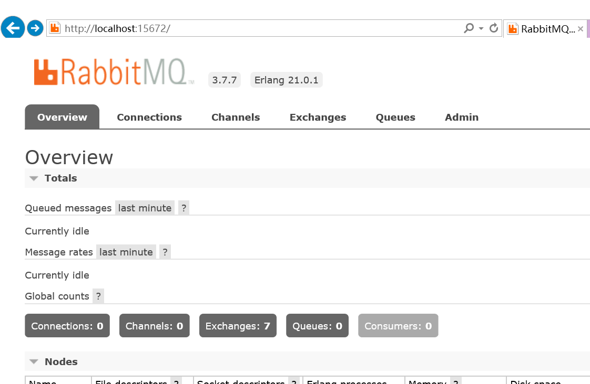

# RabbitMQ
消息队列

# 一、基础命令
安装完成RabbitMQ以后，会有一个默认的账户Guest，这个用户得删除,然后新建一个自己的用户，并且赋予管理员权限

#### 1.新建用户
cmd->到RabbitMQ的安装目录下的一个Sbin目录,正常情况下安装完成后在开始菜单栏可以找到这个目录


```
rabbitmqctl  add_user  hc 123456
```

这样就创建了一个username=hc,password=123456的用户了

#### 2.创建虚拟主机
虚拟主机这个概念,很不好懂，看了别人的博客,可以把这个概念理解成c#里面的“名称空间”
```
rabbitmqctl  add_vhost  hc_mq
```
这里就创建了一个名称为hc_mq的虚拟主机


#### 3.给用户、虚拟主机赋予权限
```
rabbitmqctl  set_permissions  -p hc_mq hc  ".*"  ".*"  ".*"
```

这里就为hc用户,hc_mq的虚拟主机赋予了所有权限,当然用户跟虚拟主机的权限也可以单独分开来赋权限

#### 4.设置角色
```
rabbitmqctl  set_user_tags yy administrator
```

这里就给hc用户设置了超级管理员的角色


#### 5.删除默认用户
```
rabbitmqctl delete_user guest
```


#### 6.查看用户信息

```
rabbitmqctl limt_user_permissions hc
```


#二、普通模式发送、接受消息

#### 1.新建一个控制台程序作为发送端Send
```
static void Main(string[] args)
        {
            var factory = new ConnectionFactory() { HostName = "localhost", UserName = "hc", Password="123456" };
            using (var connection = factory.CreateConnection())
            using (var channel = connection.CreateModel())
            {
                channel.QueueDeclare(queue: "hello",
                                     durable: false,
                                     exclusive: false,
                                     autoDelete: false,
                                     arguments: null);

                string message = "Hello World!";
                var body = Encoding.UTF8.GetBytes(message);

                channel.BasicPublish(exchange: "",
                                     routingKey: "hello",
                                     basicProperties: null,
                                     body: body);
                Console.WriteLine(" [x] Sent {0}", message);
            }

            Console.WriteLine(" Press [enter] to exit.");
            Console.ReadLine();
```

#### 2.创建一个控制台程序作为接受端Revice

```
static void Main(string[] args)
        {
            var factory = new ConnectionFactory() { HostName = "localhost", UserName = "hc", Password = "123456" };
            using (var connection = factory.CreateConnection())
            using (var channel = connection.CreateModel())
            {
                channel.QueueDeclare(queue: "hello",
                                     durable: false,
                                     exclusive: false,
                                     autoDelete: false,
                                     arguments: null);

                var consumer = new EventingBasicConsumer(channel);
                consumer.Received += (model, ea) =>
                {
                    var body = ea.Body;
                    var message = Encoding.UTF8.GetString(body);
                    Console.WriteLine(" [x] Received {0}", message);
                };
                channel.BasicConsume(queue: "hello",
                                     noAck: true,
                                     consumer: consumer);

                Console.WriteLine(" Press [enter] to exit.");
                Console.ReadLine();

            }
        }
```
**先启动Send就会显示发送成功**<br />
<br />

**这个是可以查看RabbitMq服务器上的消息**<br />
```
rabbitmqctl list_queues
```
<br />
**本来消息数量是0条，启动发送端以后就变成1条了**<br />

**然后启动接收端**<br />
<br />

**再看一次服务器上 消息**<br />
<br />
**本来消息数量是1条，启动接受端以后就又变成0条了**<br />


#三、工作队列(分发模式)

#### 1.新建接收端,完成后打开两个处于等待发送端发送消息 状态
```
 static void Main(string[] args)
        {
            var factory = new ConnectionFactory();
            factory.HostName = "localhost";
            factory.UserName = "hc";
            factory.Password = "123456";

            using (var connection = factory.CreateConnection())
            {
                using (var channel = connection.CreateModel())
                {
                    channel.QueueDeclare("hello", false, false, false, null);

                    var consumer = new QueueingBasicConsumer(channel);
                    channel.BasicConsume("hello", true, consumer);

                    while (true)
                    {
                        var ea = (BasicDeliverEventArgs)consumer.Queue.Dequeue();

                        var body = ea.Body;
                        var message = Encoding.UTF8.GetString(body);

                        int dots = message.Split('.').Length - 1;
                        Thread.Sleep(dots * 1000);

                        Console.WriteLine("Received {0}", message);
                        Console.WriteLine("Done");
                    }
                }
            }
        }
```

#### 2.新建发送端
```
 static void Main(string[] args)
        {
            var factory = new ConnectionFactory();
            factory.HostName = "localhost";
            factory.UserName = "hc";
            factory.Password = "123456";

            using (var connection = factory.CreateConnection())
            {
                using (var channel = connection.CreateModel())
                {
                    channel.QueueDeclare("hello", false, false, false, null);
                    string message = GetMessage(args);
                    var properties = channel.CreateBasicProperties();
                    properties.DeliveryMode = 2;

                    var body = Encoding.UTF8.GetBytes(message);
                    channel.BasicPublish("", "hello", properties, body);
                    Console.WriteLine(" set {0}", message);
                }
            }

            Console.ReadKey();

        }

        private static string GetMessage(string[] args)
        {
            return ((args.Length > 0) ? string.Join(" ", args) : "Hello World!");
        }
```

**直接用cmd 模式来发送5条数据**<br />
<br />
**这个时候两个接收端都分别收到了数据**<br />
<br />
 > 特别注意的是,服务端一共发了5条数据,而两个接收端分别收到3条跟2条数据,这个过程是由Rabbi自动去完成的，他自己把消息平均分发给接收端
 > 但是这种模式也不是理想的分发模式,假如说，对于两个工作者。当奇数个消息的任务比较重，但是偶数个消息任务比较轻时，奇数个工作者始终处理忙碌状态，
 > 而偶数个工作者始终处理空闲状态。但是RabbitMQ并不知道这些，他仍然会平均依次的分发消息。
 > 为了改变这一状态，我们可以使用basicQos方法，设置perfetchCount=1 。这样就告诉RabbitMQ 不要在同一时间给一个工作者发送多于1个的消息，或者换句话说。
 > 在一个工作者还在处理消息，并且没有响应消息之前，不要给他分发新的消息。相反，将这条新的消息发送给下一个不那么忙碌的工作者。
```
channel.BasicQos(0, 1, false); 
```

# 四、消息应答
消息响应默认是开启的。在之前的例子中使用了no_ack=True标识把它关闭。现在把这个标志关掉.<br />
先设置channel.BasicConsume("hello", **false**, consumer);<br />
然后最后加一句**channel.BasicAck(ea.DeliveryTag, false);**<br />
发送端代码不变,接受端代改动如下码如下<br />
```
    channel.BasicConsume("hello", false, consumer);
    while (true)
    {
        var ea = (BasicDeliverEventArgs)consumer.Queue.Dequeue();

        var body = ea.Body;
        var message = Encoding.UTF8.GetString(body);

        Thread.Sleep(5000);

        Console.WriteLine("Received {0}", message);
        Console.WriteLine("Done");

        channel.BasicAck(ea.DeliveryTag, false);
    }
```
执行以后，可以看出消息发送以后,在服务器队列里面hello有一条消息,然后执行接受端,等待接收端执行完成以后,消息就没了<br />
<br />

**这种情况是正常的,但是假如说接收端正在执行 时候、或者说是没有返回给服务端信息的话又是怎样的结果呢？**<br />
先拿掉**channel.BasicAck(ea.DeliveryTag, false);**其他代码不变<br />

**执行接收端,不等它执行完成而是直接关掉接收端**<br />
<br />
查看未应答消息的命令是:
```
rabbitmqctl list_queues name messages_ready messages_unacknowledged
```


# 五、消息持久化
前面用到的消息应答只能保证接收端不会丢失消息但是如果服务端重启了消息还是会丢失,所以这里消息持久化可以保证就算服务器重启了,消息还能保存<br />
但是并非100%的，因为RabbitMQ往磁盘写入文件还有一个时间差,在这个时间差内还是可能丢失消息的<br />
消息持久化得先设置channel.queueDeclare的第二个参数为**true**。<br />
```
channel.queueDeclare("task_queue", true, false, false, null);
```
接受端也同样需要加一句<br />
**var properties = channel.CreateBasicProperties();**<br />
**properties.SetPersistent(true);**

```
static void Main(string[] args)
        {
            var factory = new ConnectionFactory();
            factory.HostName = "localhost";
            factory.UserName = "hc";
            factory.Password = "123456";

            using (var connection = factory.CreateConnection())
            {
                using (var channel = connection.CreateModel())
                {
                    channel.QueueDeclare("task_queue", true, false, false, null);

                    var consumer = new QueueingBasicConsumer(channel);
                    channel.BasicConsume("task_queue", false, consumer);

                    var properties = channel.CreateBasicProperties();
                    properties.SetPersistent(true);

                    while (true)
                    {
                        var ea = (BasicDeliverEventArgs)consumer.Queue.Dequeue();

                        var body = ea.Body;
                        var message = Encoding.UTF8.GetString(body);

                        Thread.Sleep(2000);

                        Console.WriteLine("Received {0}", message);
                        Console.WriteLine("Done");

                        channel.BasicAck(ea.DeliveryTag, false);
                    }
                }
            }
        }
```
<br />

参考博客:http://www.cnblogs.com/yangecnu/p/4227535.html


#  六、远程访问

默认情况下 是不能远程访问的，但是假设 rabbitMQ在服务器上呢？

在rabbitMQ安装目录下 有个etc，里面有个配置文件，这个配置文件是假的，改不改都没用

要改的实际上是`C:\Users\HC\AppData\Roaming\RabbitMQ`这个里面的配置文件

默认是`guest`用户可以访问，所以添加一个其他用户

```c#
{loopback_users, ["hc"]}
```

注意:修改配置文件前先关闭RaabitMQ服务

修改后重启服务，然后添加管理插件

```c#
rabbitmq-plugins enable rabbitmq_management
```


然后访问`http://localhost:15672/#/` 就可以看到登录页面了，输入账号密码，就可以进去了




