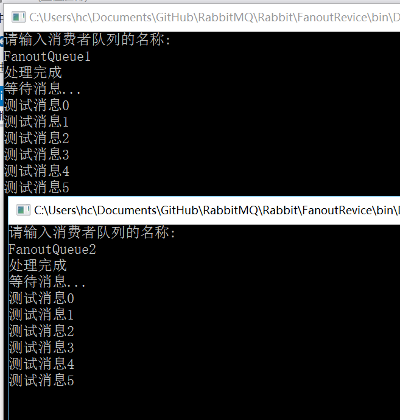
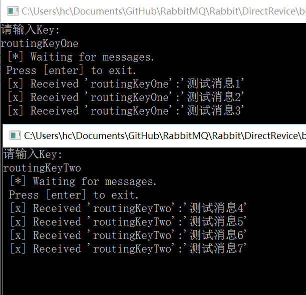
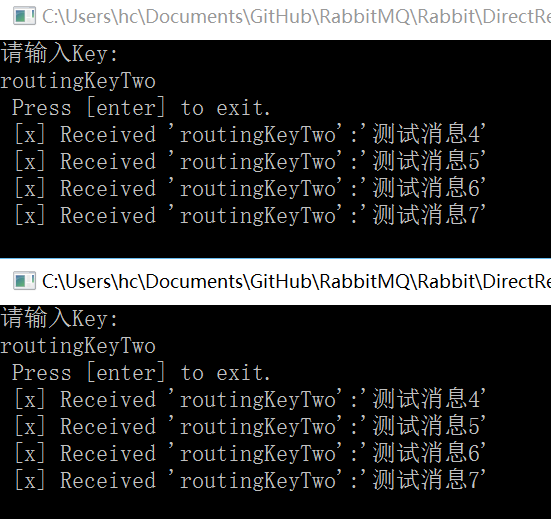
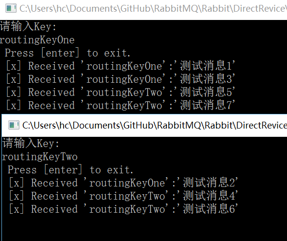
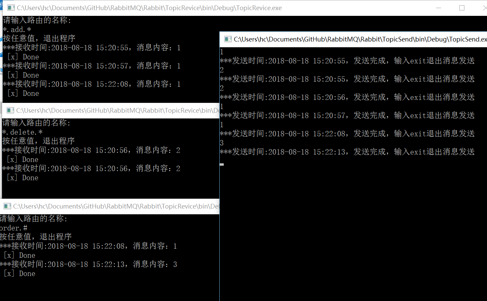
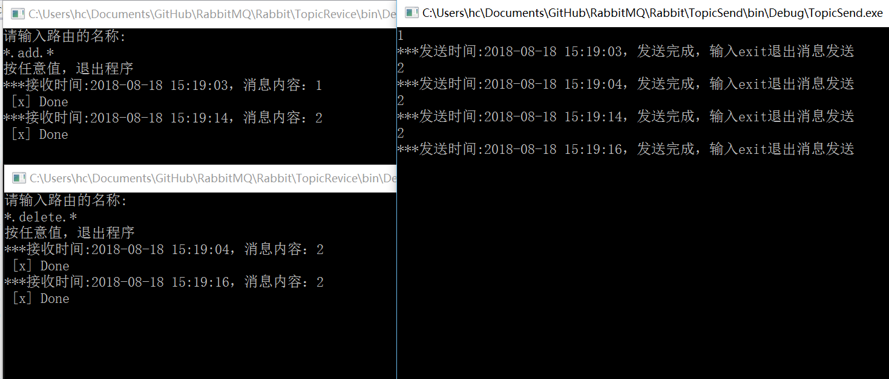

RabbitMQ消息常用的模式有`Direct`、`Fanout`、`Topic`

### Fanout （广播模式）

这种模式最简单，也是最常用的，生产者定义了ExChange 并且制定 消息规则为 Fanout,那么所有订阅了这个ExChange的队列都会受到所有的消息，然后对于自己有用的消息就处理，无用的直接不管了

生产者代码:

```c#
using RabbitMQ.Client;
using System;
using System.Collections.Generic;
using System.Linq;
using System.Text;
using System.Threading.Tasks;

namespace FanoutSend
{
    class Program
    {
        static void Main(string[] args)
        {
            ConnectionFactory client;
            client = new ConnectionFactory();
            client.HostName = "localhost";
            client.UserName = "kia";
            client.Password = "123456";

            client.RequestedFrameMax = UInt32.MaxValue;//超时时间
            client.RequestedHeartbeat = UInt16.MaxValue; //心跳超时时间 
            client.AutomaticRecoveryEnabled = true;//自动重连
            client.Protocol = Protocols.DefaultProtocol;

            using (var connection = client.CreateConnection())
            {
                using (var channel = connection.CreateModel())
                {
                    //创建一个新的，持久的交换区 
                    channel.ExchangeDeclare("TestExChange", ExchangeType.Fanout, true, false, null);

                    // 设置消息属性 
                    var properties = channel.CreateBasicProperties();
                    properties.DeliveryMode = 2; //消息是持久的，存在并不会受服务器重启影响  

                    var encoding = new UTF8Encoding();
                    for (int i = 0; i < 6; i++)
                    {
                        var msgBytes = encoding.GetBytes("测试消息"+i);
                        channel.BasicPublish("TestExChange", "", properties, msgBytes);
                    }
                    
                    channel.Close();
                }
            }


            Console.ReadKey();
        }
    }
}

```

消费者代码:

```c#
using RabbitMQ.Client;
using RabbitMQ.Client.Events;
using RabbitMQ.Client.MessagePatterns;
using System;
using System.Collections.Generic;
using System.Linq;
using System.Text;
using System.Threading.Tasks;

namespace FanoutRevice
{
    class Program
    {
        static void Main(string[] args)
        {
            Console.WriteLine("请输入消费者队列的名称:");
            var queueName = Console.ReadLine();
            var connectionFactory = new ConnectionFactory
            {
                HostName = "localhost",
                UserName = "kia",
                Password = "123456",
                Protocol = Protocols.AMQP_0_9_1,
                RequestedFrameMax = UInt32.MaxValue,
                RequestedHeartbeat = UInt16.MaxValue
            };
            Task.Factory.StartNew(() => {
                using (var connection = connectionFactory.CreateConnection())
                using (var channel = connection.CreateModel())
                {
                    // 这指示通道不预取超过1个消息 
                    channel.BasicQos(0, 1, false);
                    
                    //创建一个新的，持久的队列 
                    channel.QueueDeclare(queueName, true, false, false, null);
                    //绑定队列到交换区 
                    channel.QueueBind(queueName, "TestExChange", "");
                    using (var subscription = new Subscription(channel, queueName, false))
                    {
                        Console.WriteLine("等待消息...");
                        var encoding = new UTF8Encoding();
                        while (channel.IsOpen)
                        {
                            BasicDeliverEventArgs eventArgs;
                            var success = subscription.Next(2000, out eventArgs);
                            if (success == false) continue;
                            try
                            {
                                var msgBytes = eventArgs.Body;
                                var message = encoding.GetString(msgBytes);
                                Console.WriteLine(message);
                                channel.BasicAck(eventArgs.DeliveryTag, false);
                            }
                            catch (Exception ex)
                            {
                                channel.BasicNack(eventArgs.DeliveryTag, false, true);
                            }

                        }
                    }
                }
            });

            Console.WriteLine("处理完成");
            Console.ReadKey();
        }
    }
}

```

值得注意的是如果说交换器跟队列都是第一次定义的话，因为交换器实在发送端定义的，所以第一次打开消费者的时候是无法绑定到对应的交换器，同样的，因为队列实在消费者那里定义的，如果是先打开生产者的话，消息没有队列来监听，那就会丢失！ 这里引申了一个问题，交换机、队列到底是在生产者定义还是消费者定义？这个得根据实际情况来定了，其实两个地方都可以定义，甚至可以同时来定义。如果同时定义的话，rabbitmq自己会判断如果已经“创建过了”就不会再创建

打开两个消费者,跟生产者



可以看到两个消费者都拿到了同样的数据，这样就是广播模式了!


### Direct

direct模式 可以实现点对点，分发以及路由 这三种模式

点对点模式比较简单，一个生产者，一个消费者，生产者给消费者发送数据，就这样。

分发模式是一个生产者多个消费者的情况，

生产者S给消费者C1发送一条数据，如果得到了应答就继续给消费者C2发送数据，就这样一个个的循环发送，这两个都不是重点，主要来看看路由

在绑定队列跟 发送消息的方法中，有个参数名为`routingKey`，这个就是路由了

```c#
//绑定队列跟 交换机
channel.QueueBind("DirectQueue", "TestDirectExChange", "routingKeyOne")
//方法定义
public static void QueueBind(this IModel model, string queue, string exchange, string routingKey, IDictionary<string, object> arguments = null);

//发送消息
channel.BasicPublish("TestDirectExChange", "routingKeyOne", properties, encoding.GetBytes("测试消息1"));

//方法定义
 public static void BasicPublish(this IModel model, string exchange, string routingKey, IBasicProperties basicProperties, byte[] body);
```

经过我N多次测试，我发现一个问题。在Direct模式下面 路由其实就是队列名称了


先来消费者:

```c#
using RabbitMQ.Client;
using System;
using System.Collections.Generic;
using System.Linq;
using System.Text;
using System.Threading.Tasks;

namespace DirectSend
{
    class Program
    {
        static void Main(string[] args)
        {
            ConnectionFactory client;
            client = new ConnectionFactory();
            client.HostName = "localhost";
            client.UserName = "kia";
            client.Password = "123456";

            client.RequestedFrameMax = UInt32.MaxValue;//超时时间
            client.RequestedHeartbeat = UInt16.MaxValue; //心跳超时时间 
            client.AutomaticRecoveryEnabled = true;//自动重连
            client.Protocol = Protocols.DefaultProtocol;

            using (var connection = client.CreateConnection())
            {
                using (var channel = connection.CreateModel())
                {
                    //创建一个新的，持久的交换区 
                   channel.ExchangeDeclare("TestDirectExChange", ExchangeType.Direct, true, false, null);

                    ////创建一个新的，消息持久的队列
                    //channel.QueueDeclare("DirectQueue",true,false,false,null);

                    //channel.QueueBind("DirectQueue", "TestDirectExChange", "routingKeyOne");
                    //channel.QueueBind("DirectQueue", "TestDirectExChange", "routingKeyTwo");


                    // 设置消息属性 
                    var properties = channel.CreateBasicProperties();
                    properties.DeliveryMode = 2; //消息是持久的，存在并不会受服务器重启影响  
                    var encoding = new UTF8Encoding();

                    channel.BasicPublish("TestDirectExChange", "routingKeyOne", properties, encoding.GetBytes("测试消息1"));
                    channel.BasicPublish("TestDirectExChange", "routingKeyOne", properties, encoding.GetBytes("测试消息2"));
                    channel.BasicPublish("TestDirectExChange", "routingKeyOne", properties, encoding.GetBytes("测试消息3"));
                    channel.BasicPublish("TestDirectExChange", "routingKeyTwo", properties, encoding.GetBytes("测试消息4"));
                    channel.BasicPublish("TestDirectExChange", "routingKeyTwo", properties, encoding.GetBytes("测试消息5"));
                    channel.BasicPublish("TestDirectExChange", "routingKeyTwo", properties, encoding.GetBytes("测试消息6"));
                    channel.BasicPublish("TestDirectExChange", "routingKeyTwo", properties, encoding.GetBytes("测试消息7"));

                    channel.Close();
                }
            }


            Console.ReadKey();
        }
    }
}
```

消费者定义了一个名为`TestDirectExChange`交换机，并且是想着把1,2,3这3条数据发送给名为`routingKeyOne`的路由，4,5,6,7发送给`routingKeyTwo`

先来看看消费者，并且不申明、不指定队列，用默认队列

```c#
using RabbitMQ.Client;
using RabbitMQ.Client.Events;
using RabbitMQ.Client.MessagePatterns;
using System;
using System.Collections.Generic;
using System.Linq;
using System.Text;
using System.Threading.Tasks;

namespace DirectRevice
{
    class Program
    {
        static void Main(string[] args)
        {
            var connectionFactory = new ConnectionFactory
            {
                HostName = "localhost",
                UserName = "kia",
                Password = "123456",
                Protocol = Protocols.DefaultProtocol,
                RequestedFrameMax = UInt32.MaxValue,
                RequestedHeartbeat = UInt16.MaxValue
            };

            using (var connection = connectionFactory.CreateConnection())
            using (var channel = connection.CreateModel())
            {
               var queueName = channel.QueueDeclare().QueueName;

                Console.WriteLine("请输入Key:");
                var Key = Console.ReadLine();

                channel.QueueBind(queue: queueName,
                                  exchange: "TestDirectExChange",
                                  routingKey: Key);

                var consumer = new EventingBasicConsumer(channel);
                consumer.Received += (model, ea) =>
                {
                    var body = ea.Body;
                    var message = Encoding.UTF8.GetString(body);
                    var routingKey = ea.RoutingKey;
                    Console.WriteLine(" [x] Received '{0}':'{1}'",
                                      routingKey, message);
                };
                channel.BasicConsume(queue: queueName,
                                     autoAck: true,
                                     consumer: consumer);

                Console.WriteLine(" Press [enter] to exit.");
                Console.ReadLine();
            }

            Console.WriteLine("处理完成");
            Console.ReadKey();
        }
    }
}

```

`var queueName = channel.QueueDeclare().QueueName;`这一句即为 使用默认队列

开启两个客户端，



如果开两个 同样路由的客户端呢？



这样挺好的，达到了预想的结果！！！


但是假设消费者在绑定交换机的生活使用了 队列呢？

```c#
var queueName ="DirectQueue";
```

同样打开两个消费者



预想的结果是`routingKeyOne` 收取 1,2,3 `routingKeyTwo` 收取4,5,6,7 ，但是实际上变成分发模式了

所以才有了之前说的，如果Direct 模式下面定义了队列名称的话，那就以队列名称为主，多个客户端监听这个队列，那就变成了分发模式，如果没有定义队列的话，那就以路由名称做为队列名称，这样才可以达到理想的目的

**我的疑问是:这是测试结果，那这个确实是设计如此呢？还是我有什么地方理解错了？代码写错了？**


### Topic

topic模式是Direct模式的一个升级

taopic的路由 是一个由`.`间隔开的n个自定义的单词组，比如`order.add.admin`、`order.delete.user`这两个字符串，由我们自己输入(随便是什么,abcdefg都可以，但是自己要区分的清楚才行)。这两个字符串的意思可理解成

`管理员添加订单 `跟`用户删除订单`

topic就是可以根据`*`、`#`来实现路由模糊匹配，`*`表示单个单词而`#`表达多个单词，比如:

```json
*.add.* 可以匹配
123.add.456
a.add.123.
但是无法匹配
a.b.add.123
a.add.123.456
```

同样的topic也是无法自己定义队列名称的，如果定义了，那就是普通的分发模式了，如果没有定义，那就用路由名称来作为队列名称

先来看看生产者:

```c#
using RabbitMQ.Client;
using System;
using System.Collections.Generic;
using System.Linq;
using System.Text;
using System.Threading.Tasks;

namespace TopicSend
{
    class Program
    {
        const string TopicName1 = "order.add.admin";//管理员添加订单
        const string TopicName2 = "order.delete.user";//用户删除订单
        const string TopicName3 = "order.update.admin";//管理修改订单

        const string TopExchangeName = "topic.justin.exchange";
        const string TopQueueName = "topic.justin.queue";

        static void Main(string[] args)
        {
            ConnectionFactory client;
            #region 创建连接
            client = new ConnectionFactory();
            client.HostName = "localhost";
            client.UserName = "kia";
            client.Password = "123456";

            client.RequestedFrameMax = UInt32.MaxValue;//超时时间
            client.RequestedHeartbeat = UInt16.MaxValue; //心跳超时时间 
            client.AutomaticRecoveryEnabled = true;//自动重连
            client.Protocol = Protocols.DefaultProtocol; 
            #endregion

            using (IConnection conn = client.CreateConnection())
            {
                using (IModel channel = conn.CreateModel())
                {
                    channel.ExchangeDeclare(TopExchangeName, "topic", durable: false, autoDelete: false, arguments: null);
                    //channel.QueueDeclare(TopQueueName, durable: false, autoDelete: false, exclusive: false, arguments: null);
                    //channel.QueueBind(TopQueueName, TopExchangeName, routingKey: TopicName1);
                    //channel.QueueBind(TopQueueName, TopExchangeName, routingKey: TopicName2);
                    //channel.QueueBind(TopQueueName, TopExchangeName, routingKey: TopicName3);

                    string vadata = Console.ReadLine();
                    while (vadata != "exit")
                    {
                        var msgBody = Encoding.UTF8.GetBytes(vadata);
                        if (vadata.ToString().StartsWith("1"))
                        {
                            channel.BasicPublish(exchange: TopExchangeName, routingKey: TopicName1, basicProperties: null, body: msgBody);
                        }
                        else if (vadata.ToString().StartsWith("2"))
                        {
                            channel.BasicPublish(exchange: TopExchangeName, routingKey: TopicName2, basicProperties: null, body: msgBody);
                        }
                        else if (vadata.ToString().StartsWith("3"))
                        {
                            channel.BasicPublish(exchange: TopExchangeName, routingKey: TopicName3, basicProperties: null, body: msgBody);
                        }
                        Console.WriteLine(string.Format("***发送时间:{0}，发送完成，输入exit退出消息发送", DateTime.Now.ToString("yyyy-MM-dd HH:mm:ss")));
                        vadata = Console.ReadLine();
                    }
                }
            }
            Console.ReadKey();
        }
    }
}

```

消费者:

```c#
using RabbitMQ.Client;
using RabbitMQ.Client.Events;
using RabbitMQ.Client.MessagePatterns;
using System;
using System.Collections.Generic;
using System.Linq;
using System.Text;
using System.Threading.Tasks;

namespace TopicRevice
{
    class Program
    {
        const string TopExchangeName = "topic.justin.exchange";
        //const string TopQueueName = "topic.justin.queue";

        static void Main(string[] args)
        {

            Console.WriteLine("请输入路由的名称:");
            var queueName = Console.ReadLine();
            var connectionFactory = new ConnectionFactory
            {
                HostName = "localhost",
                UserName = "kia",
                Password = "123456",
                Protocol = Protocols.AMQP_0_9_1,
                RequestedFrameMax = UInt32.MaxValue,
                RequestedHeartbeat = UInt16.MaxValue
            };

            using (IConnection conn = connectionFactory.CreateConnection())
            {
                using (IModel channel = conn.CreateModel())
                {
                    //channel.ExchangeDeclare(TopExchangeName, "topic", durable: false, autoDelete: false, arguments: null);

                    var TopQueueName = channel.QueueDeclare().QueueName;

                    
                    channel.BasicQos(prefetchSize: 0, prefetchCount: 1, global: false);
                    channel.QueueBind(TopQueueName, TopExchangeName, routingKey: queueName);
                    var consumer = new EventingBasicConsumer(channel);
                    consumer.Received += (model, ea) =>
                    {
                        var msgBody = Encoding.UTF8.GetString(ea.Body);
                        Console.WriteLine(string.Format("***接收时间:{0}，消息内容：{1}", DateTime.Now.ToString("yyyy-MM-dd HH:mm:ss"), msgBody));
                        int dots = msgBody.Split('.').Length - 1;
                        System.Threading.Thread.Sleep(dots * 1000);
                        Console.WriteLine(" [x] Done");
                        channel.BasicAck(deliveryTag: ea.DeliveryTag, multiple: false);
                    };
                    channel.BasicConsume(TopQueueName, autoAck: false, consumer: consumer);

                    Console.WriteLine("按任意值，退出程序");
                    Console.ReadKey();
                }
            }


            Console.WriteLine("处理完成");
            Console.ReadKey();
        }
    }
}
```

现在的消费者是没有定义路由的,开启2个消费者，分别监听`*.add.*`、`*.delete.*`、消费者发送完1，2,2,1后再开一个消费者，用来监听`order.#`



消费者先发送了1，2,2,1 这4条数据，监听`*.add.*`、`*.delete.*`的客户端分别收到了两个1 跟两个2

然后再发送一个1,3， add的客户端收取到了1，delete的客户端没有收取到任何消息，但是监听`order.#`会手痛1，3两条数据，这个结果是对的


但是如果定义了队列名称的话，就变成分发了



